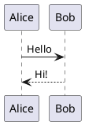

# 從 Vibe Coding 到規格驅動開發 (SDD) 實戰攻略

**從 Greenfield MVP 到 Brownfield 可維護產品的完整旅程**

---

## Hugo 靜態網站

本專案包含以 [Hugo](https://gohugo.io/) 建置的課程網站，位於 `site/` 目錄，使用 [Hextra](https://github.com/imfing/hextra) 主題（Hugo Module）。

### 目錄結構

```
site/
├── content/
│   ├── _index.md                  # 首頁
│   ├── lessons/
│   │   ├── _index.md              # 課程章節列表頁
│   │   ├── ch-intro-ai.md         # 導言：理解 Model、Agent 與 Coding Agent（Greenfield → Brownfield 弧線）
│   │   ├── ch0-warmup.md          # Ch0：AI 開發三階段演進、Vibe Coding 的價值與限制、課程路線圖
│   │   ├── ch1-vibe-coding.md     # Ch1：Vibe Coding 方法論、Prototype 退出條件、Copilot 操作
│   │   ├── ch2-mvp-to-spec.md     # Ch2：MVP 後的三條路、Proposal = MVP 結晶、TDD vs SDD
│   │   ├── ch3-openspec.md        # Ch3：Technical Spec 與 OpenSpec 工作流、OPSX 指令詳解
│   │   ├── ch4-coding-agent.md    # Ch4：Coding Agent 結構化開發、Plan Mode、Brownfield 注意事項
│   │   ├── ch5-verify-observe.md  # Ch5：Spec 驗證、AI 輔助測試、Observability、Archive
│   │   ├── ch6-team.md            # Ch6：團隊導入策略、人機協作邊界、完整生命週期回顧
│   │   └── appendix-setup.md      # 附錄：OpenSpec CLI、OpenCode、Ollama 安裝步驟
│   ├── assignments/               # 作業
│   └── resources/
│       ├── commands.md            # 常用 OPSX 指令速查
│       ├── everything-claude-code.md  # everything-claude-code 資源介紹
│       └── agent-skills-standard.md   # Agent Skills 標準與 Anthropic 官方 skills 倉庫介紹
├── themes/                        # (不使用 submodule，主題由 Hugo Module 管理)
└── config.yaml                    # Hugo 設定檔
```

### 課程結構

| 章節 | 主題 | 階段 |
|------|------|------|
| 導言 | Model、Agent、Coding Agent 原理 | 基礎 |
| Ch0 | AI 開發三階段、Vibe Coding 的價值、課程路線圖 | Greenfield |
| Ch1 | Vibe Coding 方法論、Prototype 退出條件 | Greenfield |
| Ch2 | MVP → Proposal → Brownfield 轉折點 | 轉折點 |
| Ch3 | Technical Spec、OpenSpec 工作流 | Brownfield |
| Ch4 | Coding Agent 結構化開發、Plan Mode | Brownfield |
| Ch5 | Verify、AI 測試、Observability、Archive | Brownfield |
| Ch6 | 團隊導入策略 | 規模化 |
| 附錄 | 工具安裝（OpenSpec CLI、OpenCode、Ollama） | 參考 |

### 本機開發

**前置需求：** Hugo v0.120+ extended、Go 1.21+

```bash
# 啟動本機開發伺服器（Hugo Module 會自動下載 Hextra 主題）
hugo server -s site/

# 瀏覽 http://localhost:1313
```

### Hextra 主題覆寫（Partial Override）

本專案覆寫了 Hextra 的 sidebar partial，以修正行動裝置上側欄不顯示章節連結的問題：

- **覆寫檔案**：`site/layouts/partials/sidebar.html`
- **對應上游**：`github.com/imfing/hextra@v0.12.1/layouts/_partials/sidebar.html`
- **變更內容**：將原本兩個分離的 `<ul>`（一個 `hx:md:hidden` 行動版、一個 `hx:max-md:hidden` 桌機版）合併為單一 `<ul>`，讓章節連結在行動裝置與桌機均可見。

> **升級注意**：升級 Hextra 版本後，需手動比對 `site/layouts/partials/sidebar.html` 與上游 `sidebar.html` 的差異，並重新套用本覆寫。

### 更新主題

```bash
# 更新 Hextra 至最新版本
hugo mod get -u github.com/imfing/hextra
```

### 建置

```bash
hugo -s site/ --minify
# 輸出至 site/public/（已加入 .gitignore，不納入版控）
```

### 部署

推送至 `main` branch 後，GitHub Actions 會自動建置並部署至 GitHub Pages（`gh-pages` branch）。

**線上網站：** https://github-copilot-consumer.github.io/ai-sdd-course/

**首次設定步驟：**

1. 確認 `.github/workflows/deploy.yml` 中的 `GITHUB_PAGES_URL` 已更新為正確網址：
   ```yaml
   env:
     GITHUB_PAGES_URL: https://<owner>.github.io/<repo>/
   ```
   本專案為：`https://github-copilot-consumer.github.io/ai-sdd-course/`

2. Push 至 `main` branch，觸發 GitHub Actions 工作流程

3. 至 GitHub Repository Settings > Pages，設定：
   - **Source**：`Deploy from branch`
   - **Branch**：`gh-pages`（root）

4. 稍待片刻後，站點將發佈於 `https://github-copilot-consumer.github.io/ai-sdd-course/`

**注意：**
- Workflow 使用 `enable_jekyll: false`，確保 `gh-pages` branch 包含 `.nojekyll`，讓 GitHub Pages 直接提供 Hugo 靜態資源而不經 Jekyll 處理
- 若更改 Repository 名稱，需同步更新 `deploy.yml` 中的 `GITHUB_PAGES_URL`
- 私有 Repository 需要 GitHub 付費方案才能使用 GitHub Pages
- 本機開發使用 `hugo server -s site/`，不受 `GITHUB_PAGES_URL` 影響

---

## 簡報模式

每個課程章節頁面右上角有「▶ 簡報模式」按鈕，點擊後以全螢幕投影片形式呈現頁面內容。

### 投影片切割

Markdown 中的 `---`（水平分隔線）作為投影片邊界，每個 `---` 產生一頁投影片。

### 過濾文件專用內容（`.no-slide`）

若有段落適合文件閱讀、但不應出現在投影片（如詳細操作步驟），可用 `<div class="no-slide">` 包覆：

```markdown
## 操作說明

這段標題會出現在投影片中。

<div class="no-slide">

詳細的操作步驟 Step 1、Step 2……只在文件中顯示，不會進入投影片。

</div>

重點摘要會出現在投影片中。
```

> **注意**：`<div class="no-slide">` 前後需有空行，才能讓 Hugo 的 Goldmark 正確識別為 block HTML。

### 拆分過長投影片（`<!-- split -->`）

若單張投影片內容太多，可在 `---` 之間插入 `<!-- split -->` 來手動分頁：

```markdown
## 這是內容較多的一張投影片

前半段內容……

<!-- split -->

後半段內容……（在簡報中會變成獨立的下一頁）
```

在一般文件檢視時，`<!-- split -->` 完全不可見；進入簡報模式後，該節會自動拆分為兩頁。

---

## PlantUML 圖表

課程頁面中的流程圖與架構圖使用 [PlantUML](https://plantuml.com/) 撰寫，並透過 [Kroki](https://kroki.io) 公開 API 在 Hugo 建置時渲染為 SVG，直接內嵌於頁面中（無需 JavaScript，無需本機安裝 Java）。

### 使用方式

**Fenced Code Block（推薦）：**

````markdown

````

**Shortcode（備援語法）：**

```markdown

@startuml
Alice -> Bob: Hello
Bob --> Alice: Hi!
@enduml

```

### 運作方式

Hugo 的 render hook（`site/layouts/_default/_markup/render-codeblock-plantuml.html`）在建置時攔截 `plantuml` fenced code block，以 HTTP POST 呼叫 `https://kroki.io/plantuml/svg`，並將回傳的 SVG 直接內嵌至 HTML。若 API 呼叫失敗，則 fallback 顯示原始 PlantUML 程式碼並輸出建置警告。


本專案使用 OpenSpec 進行規格驅動開發。

```bash
# 安裝
npm install -g @fission-ai/openspec

# 查看變更狀態
openspec status --change hugo-course-site

# 列出所有變更
openspec list
```

規格文件位於 `openspec/changes/hugo-course-site/`。
