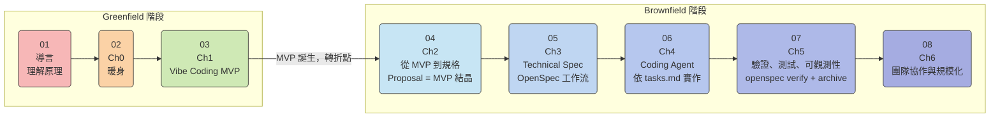

> 建立共同語言，理解為何單純的「對話式 AI」已不足以應對企業級開發。

> 💡 **想深入 Agent 原理與 OpenCode 擴展機制？** 歡迎前往 [Agent 整合與自訂擴展](/agent/) 課程，從 LLM 原理到 Skills、Tools 與 MCP 整合一次掌握。

## 學習目標


本章結束後，你將能夠：

- **辨識** AI 輔助開發的三個演進階段，並說明各階段的代表工具與限制
- **描述** 企業導入對話式 AI 開發工具後常見的三大痛點，以及背後的根本原因
- **理解** 本課程的核心目標：從「讓 AI 幫我寫 Code」升級為「讓 AI 按照規格交付 Code」，並說明這個升級解決了哪些問題


---

## AI 開發三階段演進

AI 輔助開發不是一夕之間出現的。從 2021 年至今，工具能力已經歷三次明顯的質變：

### 階段一：自動補全 (Autocomplete)

**代表工具：** GitHub Copilot（2021 年推出）、Tabnine

**典型使用場景：**
開發者在 IDE 中打字，AI 根據目前游標上下文預測並補全接下來的程式碼，類似強化版的智慧 IntelliSense。

```
// 開發者輸入函式開頭
function calculateDiscount(price, memberLevel) {
    // AI 自動補全剩餘邏輯
    if (memberLevel === 'gold') return price * 0.8;
    if (memberLevel === 'silver') return price * 0.9;
    return price;
}
```

**主要限制：**
- 只能看到游標附近的程式碼，無法理解跨檔案的系統設計
- 補全的是「語法正確」的程式碼，但不保證符合業務邏輯
- 無法主動提問，完全被動回應開發者的輸入

---

### 階段二：對話式生成 (Chat) / Vibe Coding

**代表工具：** GitHub Copilot Chat、ChatGPT、Claude

**典型使用場景：**
開發者用自然語言描述需求，AI 生成完整的程式碼片段、解釋錯誤訊息、回答技術問題。在快速原型（Greenfield）階段，這種對話式迭代方式極為有效——俗稱 **Vibe Coding**：不預先設計，跟著感覺迭代，讓想法快速落地。

```
開發者：幫我寫一個 Express.js 的 JWT 驗證 middleware

AI：好的，以下是實作...
[生成 50 行 middleware 程式碼]
```

**Vibe Coding 的真正價值：**
在 Greenfield 早期，你還不確定「要做什麼」，Vibe Coding 讓你用最低成本探索可能性、驗證想法、快速跑出 MVP。這是 AI 真正發揮速度優勢的場景。

**主要限制（在 Brownfield 階段才真正浮現）：**
- **Context 短暫性：** 每次新對話都是全新開始，AI 不記得上週討論的架構決策
- **輸出不穩定：** 同樣的問題不同時間問，可能得到風格迥異的答案
- **需求無法追溯：** 所有討論只存在於 Chat History，無法與程式碼版本對應

> 重要：這些「限制」在 Greenfield 原型階段通常無傷大雅。問題出在 **MVP 之後繼續用 Vibe Coding 方式開發**——這才是本章「災難現場」的根本原因。

---

### 階段三：規格驅動生成 (Spec-Driven)

**代表工具：** OpenCode + OpenSpec、GitHub Copilot Workspace（beta）

**典型使用場景：**
開發者先撰寫規格文件（What），AI 以規格為依據生成程式碼、驗證實作是否符合需求、並在完成後歸檔規格。

```
openspec new change "add-jwt-auth"
# AI 先產生 proposal.md、specs/、design.md、tasks.md
# 然後依 tasks.md 逐步實作，每步都能對照 spec 驗證
openspec verify --change "add-jwt-auth"
# ✔ Implementation matches spec: 5/5 requirements satisfied
```

**解決的根本問題：**
規格作為「單一事實來源」，開發、驗證、歸檔全程可追溯，不再依賴易逝的 Chat History。

---

## 常見災難現場

以下三個場景都有一個共同前提：**MVP 已跑通，團隊進入持續迭代階段（Brownfield）——但仍沿用 Vibe Coding 的開發方式**。這才是問題真正爆發的時機。

### 災難一：代碼可讀性低

> **Brownfield 脈絡：** 這個問題在 Greenfield 打原型時幾乎感覺不到；但當 MVP 上線、需要持續維護時，沒有設計意圖記錄的程式碼就成了技術負債地雷。

**具體情境：**
Sprint Review 前一天，工程師用 Copilot Chat 快速生成了一個訂單計算模組。隔天 Code Review 時，沒有人能解釋這段程式碼為什麼這樣寫——連寫的人自己也不確定，因為他只是「讓 AI 生成，測試過了就合進去」。三個月後需求改動，沒有人敢動這段程式碼。

<!-- split -->

**根本原因：**
AI 生成的程式碼缺乏背後的設計意圖（Design Intent）。沒有記錄「為何這樣設計」，只有程式碼本身。

**解法方向：**
在實作前先產生 `design.md`（記錄設計決策與取捨），讓程式碼的「為什麼」有所依據。即便日後改動，也能從設計文件理解原始意圖。

---

### 災難二：輸出不穩定

> **Brownfield 脈絡：** 原型期兩個人風格不同還可以接受；但當 codebase 越來越大、越來越多人協作，這個問題會嚴重拖累 Code Review 效率。

**具體情境：**
團隊建立了一個「用 AI 生成 API 端點」的標準流程，但不同工程師、不同時間使用相同 Prompt，得到的程式碼風格差異極大：有的用 async/await，有的用 Promise chain；有的用 class，有的用 function；錯誤處理方式也各不相同。Code Review 花了大量時間在風格統一上。

**根本原因：**
語言模型的輸出本質上是機率抽樣（見導言章節），加上每次 Chat 的 Context 不同，輸出的「風格自由度」很高。

**解法方向：**
透過 `.github/copilot-instructions.md`（ch1 會詳細介紹）或 OpenSpec 的 `context` 設定，在每次 AI 生成前注入團隊的技術規範，讓 AI 在明確的約束條件下生成程式碼。

---

### 災難三：需求流失

> **Brownfield 脈絡：** 打原型時你一個人知道全局，不需要記錄。但進入多人協作、持續迭代後，「只存在 Chat 裡的決策」就是系統知識的無底洞。

**具體情境：**
Product Manager 在 Slack 討論了新功能需求，Architect 在 Copilot Chat 確認了技術可行性，工程師在另一個 Chat 視窗開始實作。三週後需求變動，沒有人記得當初為什麼做了某個設計選擇。查找 Slack 和 Chat History 花了半天，最後還是找不到關鍵的決策脈絡。

**根本原因：**
需求、設計、實作存在於三個互不相連的平台（Slack / Chat / Git），沒有形成「可追溯的鏈條」。

**解法方向：**
OpenSpec 的 `changes/` 目錄作為每個功能的「工作空間」，從提案（proposal）到規格（specs）到設計（design）到任務（tasks），全程儲存在 Git 倉庫中，與程式碼版本一同管理，永遠可以找到「當初為什麼這樣做」。

---

## 課程核心目標

本課程走完一條完整的開發旅程：

**階段一：Greenfield — 用 Vibe Coding 快速打造 MVP**
用 Copilot 和 Coding Agent 的速度優勢，在不過度設計的前提下，快速迭代出能跑的 MVP。

**階段二：Brownfield — 用 SDD 讓 MVP 成為可維護的產品**
當 MVP 通過驗證，正式進入持續迭代，這時需要規格作為「單一事實來源」——讓 AI 的自主行動可預測、可驗證、可追溯。

換句話說，這個升級不是放棄 Vibe Coding，而是**知道何時應該從 Vibe Coding 切換到 SDD**：

| 階段 | 方法 | 目標 |
|------|------|------|
| Greenfield（原型期） | Vibe Coding | 快速驗證想法，打出 MVP |
| MVP 誕生（轉折點） | 回推 Proposal | 把 MVP 的設計意圖結晶成正式需求 |
| Brownfield（迭代期） | SDD + Coding Agent | 可預測、可驗證、可追溯的持續開發 |

這個升級不是放棄 AI 的創造力，而是為 AI 的自主行動建立**可預測的邊界**：

| 升級前 | 升級後 |
|--------|--------|
| 需求口頭討論，存在 Chat | 需求寫成 proposal.md，存入 Git |
| AI 自由發揮生成程式碼 | AI 依 tasks.md 逐步實作 |
| 「感覺差不多對了」就合進去 | `openspec verify` 確認符合 spec |
---

## Greenfield vs Brownfield

在正式開始課程之前，先確立兩個最重要的術語：

| | **Greenfield** | **Brownfield** |
|---|---|---|
| **定義** | 從零開始的全新專案 | 在既有 codebase 上繼續開發 |
| **特點** | 沒有歷史包袱，可以自由設計 | 有歷史包袱，修改需謹慎 |
| **AI 使用方式** | Vibe Coding 快速迭代 | SDD 結構化開發 |
| **主要風險** | 過度設計，延誤驗證 | 技術債累積，可維護性崩潰 |
| **本課程的位置** | Ch1（Vibe Coding MVP） | Ch2 開始（SDD 主戰場） |

**關鍵觀念：** SDD 的主戰場是 Brownfield。不是「從一開始就要做 SDD」，而是「MVP 誕生後，SDD 幫你讓它活得更久」。

---

## 課程路線圖



> 附錄：工具安裝（OpenSpec CLI、OpenCode、Ollama）
