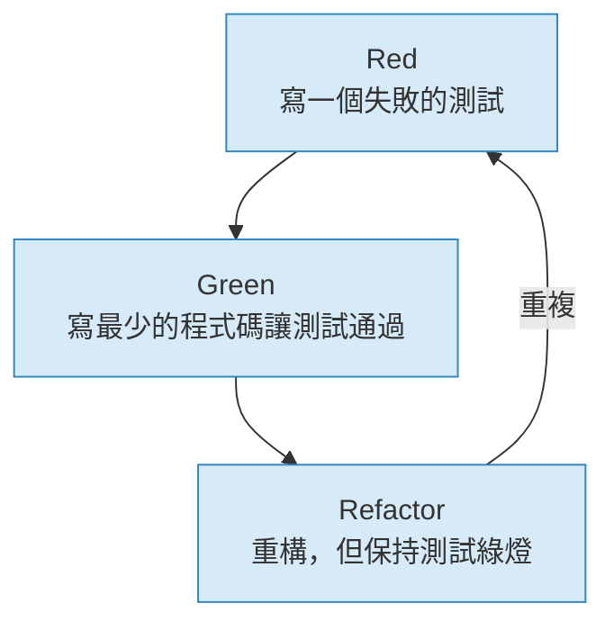
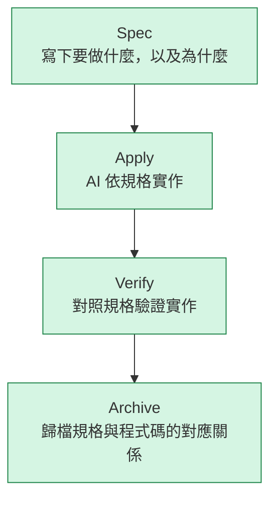

> 你的 MVP 做出來了，然後呢？認識 SDD，學會為既有程式碼建立可追蹤的規格。

## 學習目標


本章結束後，你將能夠：

- **認識** MVP 之後的三條路，並說明為何「正式化」是最好的選擇
- **理解** Proposal = MVP 結晶的概念，並能為一個 Vibe Coding 的產物撰寫 proposal.md
- **解釋** TDD 與 SDD 的差異，並說明在 Vibe Coding 後的 MVP 情境下，為何需要 SDD
- **執行** 在 MVP 專案上初始化 OpenSpec 的完整流程
- **整合** OpenSpec validate 進入 GitHub Actions CI/CD 流水線


---

## 轉折點

打開你在 Ch1 Vibe Code 出來的 Todo List API。

花一分鐘，誠實回答這三個問題：

1. **每個函式的設計意圖是什麼？** 你當初為什麼這樣設計 todo id 的生成邏輯？為什麼選擇這個資料結構？
2. **需求改了，你知道要改哪裡嗎？** 如果 PM 說「我們需要支援多個 user 各自的 todo list」，你確定改動範圍是什麼嗎？
3. **三個月後同事看得懂嗎？** 如果你休假兩週，一個新同事拿到這份 code，他能在一小時內理解並安全地新增一個功能嗎？

如果有任何一個問題的答案是「不確定」——

**歡迎來到 Brownfield。**

Brownfield 不是貶義詞，它是現實。絕大多數軟體開發工作都在既有 codebase 上進行。MVP 的 code 一旦有人用、一旦有人要繼續改，它就從 Greenfield 變成了 Brownfield。

SDD 的主戰場就在這裡。

---

## MVP 之後的三條路

當 MVP 通過驗證，你面前有三條路：

### 路一：直接上 production

把 Vibe Coding 的原型直接部署，繼續用同樣的方式迭代。

**後果：** 這正是 Ch0「災難現場」的起點。可讀性低、輸出不穩定、需求流失——這三個問題會隨著時間複利累積。MVP 上線的第一天是技術負債最少的一天，往後每一天都在加速惡化。

---

### 路二：砍掉重練

「原型做完了，現在用正確的方式重新寫一遍。」

**後果：** 這條路浪費了 MVP 最珍貴的東西——**你從原型中學到的真實知識**。哪些假設被驗證了？哪些邊界情況比你預期的更重要？哪些功能用戶根本不在意？這些「從做中學」的洞察，不會在重寫中自動保留。

---

### 路三：正式化（本課程選擇的路）

**把 MVP 的設計意圖結晶成規格，再以規格為基礎繼續開發。**

這條路的核心動作：
1. 回顧 MVP，把「我確認過的東西」寫成 `proposal.md`
2. 在 MVP 專案上初始化 OpenSpec
3. 從 Proposal 產生 Technical Spec，讓後續每個功能都有可追溯的規格

這不是重寫，也不是放棄原型的成果。這是讓 MVP「長大」成為可維護產品的正確方式。

---

## Proposal = MVP 的結晶

在傳統開發流程中，`proposal.md` 是「事前預測」：你還沒寫任何程式碼，就要描述你打算做什麼。

**在 SDD 的 Brownfield 脈絡下，Proposal 是「事後結晶」。**

你已經 Vibe Code 出一個能跑的 MVP，你對這個產品的真實了解比任何 PRD 都深。Proposal 的任務是把這些了解記錄下來：

- **我們從原型中確認了什麼**（哪些假設成立了）
- **哪些要留**（核心功能、已驗證的設計選擇）
- **哪些要改**（已知的技術負債、需要補強的邊界處理）
- **邊界在哪**（這個版本做什麼、不做什麼）

### 範例：從 Todo MVP 回推 Proposal

假設你在 Ch1 Vibe Code 出了一個 Todo List API。以下是一個回推的 proposal.md 範例：

```markdown
## Why

Ch1 的 Todo MVP 已驗證核心 CRUD 流程可行，PM 確認方向正確，
準備進入正式迭代。需要建立規格基礎，讓後續開發可追蹤。

## What Changes

- **保留** 基本 CRUD（新增、列出、標記完成、刪除）
- **補強** 輸入驗證（title 不能為空、id 必須存在才能操作）
- **移除** 記憶體儲存 → 改為 SQLite 持久化
- **延後** 多用戶支援（在 Scope 外明確標注）

## Scope

### In Scope
- Todo CRUD API（POST /todos、GET /todos、PATCH /todos/:id、DELETE /todos/:id）
- 基本錯誤處理（400 Bad Request、404 Not Found）
- SQLite 資料持久化

### Out of Scope
- 用戶認證與授權
- 多用戶隔離
- Todo 分類與標籤
```

**關鍵差異：** 這份 Proposal 不是在描述「你希望做什麼」，而是在記錄「你從 MVP 中學到了什麼，以及接下來要做的具體決定」。

---

## TDD vs SDD：不是替代，而是互補

在 AI 輔助開發的場景中，TDD（測試驅動開發）有一個根本限制：它能驗證程式碼**是否正確**，但無法告訴 AI **應該做什麼**。

**重要前提：** 你的 MVP 可能連測試都沒有（Vibe Coding 嘛）。TDD 的前提是「開發者腦中已經知道要做什麼，測試只是把這個知道具體化」。但在 Vibe Coding 後的 Brownfield 情境下，這個前提往往不成立——你的 code 是迭代出來的，很多設計決策是在過程中才確定的。

SDD 從更上游開始：先定義**要做什麼**（Spec），再讓 AI 實作，最後用測試和 verify 一起驗證。

### TDD 的核心流程



TDD 的前提是：**開發者腦中已經知道要做什麼**，測試只是把這個「知道」具體化為可驗證的形式。

### SDD 的核心流程



SDD 的前提是：**AI 需要外部的「做什麼」指引**，才能自主完成多步驟的開發任務。

### 對比表：TDD vs SDD

| 維度 | TDD | SDD |
|------|-----|-----|
| **解決的問題** | 如何驗證程式碼正確性 | 如何讓 AI 有明確的實作目標 |
| **核心產物** | 測試程式碼（.test.ts） | 規格文件（spec.md、tasks.md） |
| **輸入** | 測試案例 | 自然語言的需求描述 |
| **驗證時機** | 每次程式碼變動後（CI） | 實作完成後（`openspec verify`） |
| **歷史追溯** | Git blame + test file | `openspec/changes/` 目錄 |
| **適用場景** | 邏輯密集的演算法、API contract | 功能開發、需求變更、重構 |
| **MVP 後情境** | 需要先補測試才能用 | 直接從 MVP 回推 Spec 開始 |

**結論：** SDD 不是用來取代 TDD，而是在 TDD 之上加了一層「需求-實作」的可追溯鏈。理想的 AI 輔助開發工作流是 **SDD + TDD 並用**：用 Spec 指引 AI 做什麼，用 Test 驗證 AI 做對了沒有。

---

## 在 MVP 專案上初始化 OpenSpec

> 在開始之前，請先確認你已完成工具安裝。若尚未安裝 OpenSpec CLI，請先前往[附錄：工具安裝與環境設定](/appendix/setup/)完成安裝。

### 系統需求

- Node.js 18.x 或以上（`node --version` 確認）
- npm 9.x 或以上（`npm --version` 確認）
- Git 已初始化的專案目錄（你的 Todo MVP 目錄）

### Step 1：進入 MVP 專案目錄

```bash
cd todo-mvp   # 你在 Ch1 建立的 MVP 專案
```

### Step 2：在 MVP 專案中初始化 OpenSpec

```bash
openspec init
```

預期輸出：
```
✔ Created openspec/config.yaml
✔ Created openspec/specs/ directory
✔ Created openspec/changes/ directory
✔ Created openspec/adr/ directory
OpenSpec initialized successfully!
```

### Step 3：確認目錄結構

初始化後，你的 MVP 專案應該包含：

```
todo-mvp/
├── openspec/
│   ├── config.yaml          # OpenSpec 設定（schema、語言等）
│   ├── specs/               # 主規格目錄（已歸檔的 capability spec）
│   ├── changes/             # 進行中的變更工作空間
│   └── adr/                 # Architecture Decision Records
├── index.js                 # 你的 MVP code
└── package.json
```

### Step 4：建立第一個 Change（驗證環境正常）

```bash
openspec new change "formalize-todo-api"
```

預期輸出：
```
✔ Created change 'formalize-todo-api' at openspec/changes/formalize-todo-api/
```

---

## SDD 核心哲學

### Fluid & Iterative：流動且迭代

SDD 刻意設計為**非線性**的工作流。你不需要完成所有規格文件後才能開始實作，也可以在實作中途發現問題後回去更新 Spec。

```
[Explore] ←→ [Spec] ←→ [Apply] ←→ [Verify] ←→ [Archive]
              ↑_________________________________↑
                     任何時候都可以更新 Spec
```

### OpenSpec 解決的問題

#### 對抗程式碼熵 (Code Entropy)

程式碼熵是衡量專案混亂程度的指標。常見症狀：

- 同一個概念有 3 種不同命名（`user_id`、`userId`、`uid`）
- 相同邏輯在 5 個地方各自實作，有微小差異
- 沒有人知道某個函式的呼叫者是誰

OpenSpec 透過將設計決策明確寫入 `specs/` 和 `design.md`，讓 AI 在每次生成程式碼時都能參考「團隊的決定是什麼」，從源頭減少熵的產生。

#### Drift Detection：偵測實作偏離

`openspec verify` 會對照 `specs/` 目錄的 requirement 與 scenario，檢查實作是否符合規格。

```bash
$ openspec verify --change "formalize-todo-api"
Checking 5 requirements...
  ✔ Todo can be created with a non-empty title
  ✔ Todo list returns all existing todos
  ✗ DRIFT: Todo deletion returns 404 for non-existent id
    Expected: 404 response with error message
    Found: No id validation in DELETE handler
```

---

## 與現有流程整合

### 與 Agile 整合

將 OpenSpec 的 `proposal.md` 作為 **Definition of Ready**（進入 Sprint 的前提），`verify` 通過作為 **Definition of Done**：

```
Backlog Item
  ↓ [Product Owner 確認需求]
proposal.md + specs/*.md 撰寫完成  ← Definition of Ready
  ↓ [Sprint Planning]
tasks.md 分配到 Sprint
  ↓ [開發中]
openspec apply → openspec verify   ← Definition of Done
  ↓ [Sprint Review]
openspec archive
```

### 與 CI/CD 整合

在 Pull Request 流程中加入 `openspec validate`，確保沒有規格文件遺失或格式錯誤：

建立 `.github/workflows/openspec-validate.yml`：

```yaml
name: OpenSpec Validate

on:
  push:
    branches: [main]
  pull_request:
    branches: [main]

jobs:
  validate:
    runs-on: ubuntu-latest
    steps:
      - uses: actions/checkout@v4

      - name: Setup Node.js
        uses: actions/setup-node@v4
        with:
          node-version: '20'

      - name: Install OpenSpec
        run: npm install -g @fission-ai/openspec

      - name: Validate OpenSpec
        run: openspec validate
        # 失敗時：輸出哪些規格文件有格式錯誤或缺少必要欄位
        # 失敗的 PR 會被 block，直到規格修正為止
```

---

## Lab 實戰：為 Ch1 的 MVP 撰寫 Proposal

**目標：** 為你在 Ch1 Vibe Code 出來的 Todo List MVP，回推撰寫一份 `proposal.md`。

**前置條件：**
- 完成 Ch1 Lab B（有一個能跑的 Todo List API）
- 完成本章「在 MVP 專案上初始化 OpenSpec」（`openspec init` 成功）

**步驟：**

1. **回顧你的 MVP**
   打開 `index.js`，列出你實作的所有功能（不要翻 Copilot 的對話紀錄，靠你現在對 code 的理解來整理）。

2. **建立新的 Change**
   ```bash
   openspec new change "formalize-todo-api"
   ```

3. **撰寫 proposal.md**
   在 `openspec/changes/formalize-todo-api/` 目錄下，建立 `proposal.md`，回答這三個問題：

   **Why（為什麼要正式化）：**
   - MVP 驗證了什麼？
   - 為什麼現在需要建立規格？

   **What Changes（要做哪些改動）：**
   - 哪些現有功能要保留？
   - 哪些已知問題要補強？（輸入驗證？錯誤處理？）
   - 哪些功能明確不做？

   **Scope（邊界）：**
   - 列出 In Scope 的 API endpoints
   - 列出 Out of Scope 的功能

4. **請 Copilot 幫你檢查**
   把你的 proposal.md 貼給 Copilot Chat，問：
   ```
   這份 proposal.md 有哪些需求描述不夠清晰？
   哪些 scope 邊界可能造成後續開發時的模糊地帶？
   ```

**Done criteria：**
- `openspec/changes/formalize-todo-api/proposal.md` 存在
- 包含 Why、What Changes、Scope 三個段落
- Scope 中明確列出 In Scope 和 Out of Scope

> 這份 Proposal 就是你進入 Ch3 的入場券。下一章，我們將從 Proposal 產生 Technical Spec。
