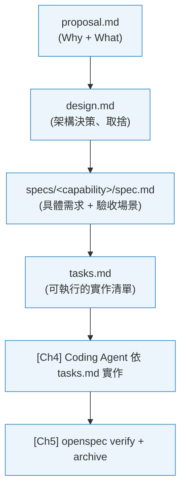
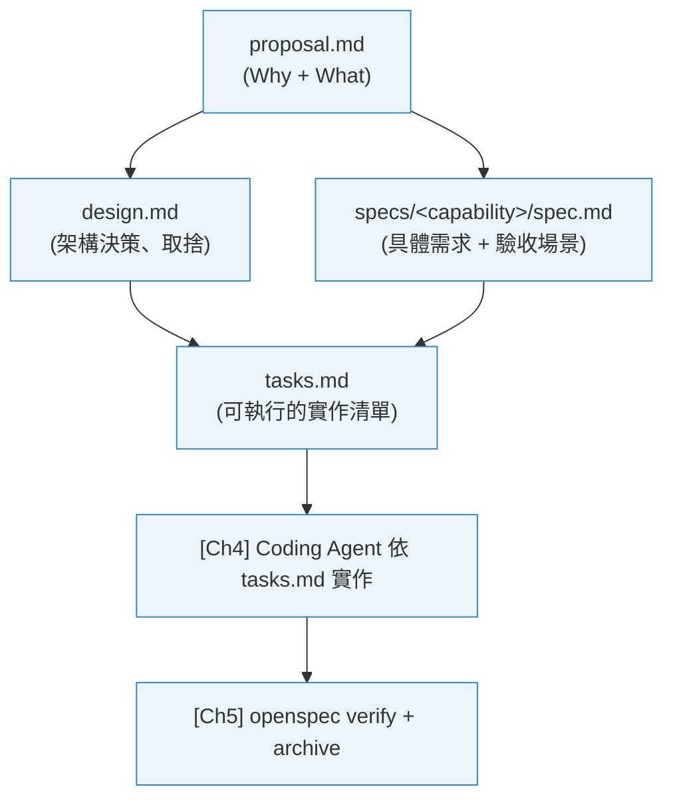

> 從 Proposal 到可執行的 Technical Spec，掌握 Brownfield 開發的規格工具鏈。

## 從 Proposal 到 Technical Spec

上一章，你為 Ch1 的 Todo MVP 回推寫了一份 `proposal.md`。那份 Proposal 是**非技術性的規格**：它說的是「我們決定做什麼、不做什麼」，但還沒有回答「要怎麼做、具體的 API 行為是什麼、驗收標準是什麼」。

這章要把它轉化為可執行的 **Technical Spec**——這是 Brownfield 開發的核心工具鏈：



有了完整的 Technical Spec，Coding Agent 不再需要猜測「我應該怎麼實作這個功能」——它有清晰的需求、設計決策、驗收標準，可以自主完成多步驟的實作任務。

---

## 學習目標


本章結束後，你將能夠：

- **執行** OpenSpec 完整工作流（new → ff/propose → apply → verify → archive）
- **操作** 每個 OPSX 指令，並理解其輸入、輸出與適用時機
- **應用** 多工並行，同時維護兩個 change 而不混亂
- **完成** 從 Proposal 生成完整 Technical Spec 的完整流程


---

## 3.1 環境初始化

### 系統需求

| 項目 | 需求 | 確認指令 |
|------|------|---------|
| Node.js | 18.x 或以上 | `node --version` |
| npm | 9.x 或以上 | `npm --version` |
| OpenCode | 最新版 | `opencode --version` |
| Git | 已初始化 | `git status` |

### 安裝步驟

**安裝 OpenSpec CLI：**
```bash
npm install -g @fission-ai/openspec
```
預期輸出：
```
added 127 packages in 8s
```

**在專案初始化：**
```bash
cd your-project
openspec init
```
預期輸出：
```
✔ Created openspec/config.yaml
✔ Created openspec/specs/ directory
✔ Created openspec/changes/ directory
✔ Created openspec/adr/ directory
OpenSpec initialized successfully!
```

### 初始化後的目錄結構

```
your-project/
├── openspec/
│   ├── config.yaml          # OpenSpec 設定
│   ├── specs/               # 已歸檔的 capability 規格
│   │   └── <capability>/
│   │       └── spec.md
│   ├── changes/             # 進行中的變更工作空間
│   │   └── <change-name>/
│   │       ├── .openspec.yaml
│   │       ├── proposal.md
│   │       ├── design.md
│   │       ├── specs/
│   │       └── tasks.md
│   └── adr/                 # 架構決策記錄
│       └── 001-why-sdd.md
└── src/
```

### Artifacts 依賴關係



**讀取順序：** proposal 先（Why）→ design（How）→ specs（What）→ tasks（Steps）

---

## 3.2 OPSX 核心指令詳解

### `/opsx:explore` — 在寫 Code 前先調查

**完整語法：**
```
/opsx:explore <描述你想調查的問題>
```

**前置條件：** OpenCode 已開啟專案目錄，且有 codebase 可搜尋。

**適用時機：** 當你面對一個模糊的問題（「網站變慢了」、「為什麼這個 API 偶爾失敗」），需要先調查再規劃。

**執行描述：**
AI 以唯讀模式（Plan Mode）搜尋整個 codebase，找出相關程式碼、依賴關係和潛在瓶頸，生成調查報告但不修改任何檔案。

**終端機輸出範例：**
```
/opsx:explore 為什麼訂單列表 API 的回應時間超過 3 秒

> Exploring codebase...
> Reading: src/controllers/OrderController.ts
> Reading: src/services/OrderService.ts
> Reading: src/repositories/OrderRepository.ts

Investigation Report:

## Root Cause Candidates

1. **N+1 Query (High Probability)**
   OrderRepository.findAll() 在迴圈中為每個 order 額外查詢 customer 資訊
   File: src/repositories/OrderRepository.ts:45

2. **Missing Index**
   orders 表的 created_at 欄位沒有 index，全表掃描
   File: migrations/001_create_orders.sql

3. **No Pagination**
   API 一次返回所有訂單，資料量大時無上限

## Recommendation
建議先建立 `add-order-list-optimization` change 來解決 N+1 Query 問題。
```

**常見錯誤：**
- `Error: No codebase index found` → 確認 OpenCode 已開啟專案根目錄（非單一檔案）

---

### `/opsx:new <name>` — 建立新的變更工作空間

**完整語法：**
```
/opsx:new <change-name>
# 或使用 openspec CLI
openspec new change "<change-name>"
```

**前置條件：** OpenSpec 已初始化（存在 `openspec/` 目錄）。

**適用時機：** 每當要開始一個新的功能開發、Bug 修復或重構任務。

**執行描述：**
在 `openspec/changes/<name>/` 建立一個新的工作空間目錄，包含 `.openspec.yaml` 設定檔，定義此 change 使用的 schema。

**終端機輸出範例：**
```
openspec new change "add-user-auth"

- Creating change 'add-user-auth'...
✔ Created change 'add-user-auth' at openspec/changes/add-user-auth/ (schema: spec-driven)
```

**常見錯誤：**
- `Error: Change 'add-user-auth' already exists` → 使用不同名稱，或先確認是否要繼續現有的 change（`openspec status --change "add-user-auth"`）

---

### `/opsx:ff` — Fast-Forward，一次生成所有規格文件

**完整語法：**
```
/opsx:ff
# 或
/opsx-propose <change-name>
```

**前置條件：** 已用 `/opsx:new` 建立 change，且 AI 知道你想做什麼（通常在 Chat 中先描述需求）。

**適用時機：** 當你想快速從「一句話需求」直接生成 proposal + design + specs + tasks 的完整 artifacts。

**執行描述：**
AI 依序生成所有 artifacts（按依賴順序：proposal → design → specs → tasks），每個 artifact 完成後寫入對應檔案。

**終端機輸出範例：**
```
/opsx:ff 我要建立 User 的 CRUD API，包含 create、read、update、delete

> Creating proposal.md...
✔ Written: openspec/changes/add-user-crud/proposal.md

> Creating design.md...
✔ Written: openspec/changes/add-user-crud/design.md

> Creating specs...
✔ Written: openspec/changes/add-user-crud/specs/user-crud/spec.md

> Creating tasks.md...
✔ Written: openspec/changes/add-user-crud/tasks.md

All artifacts complete! Progress: 4/4
Ready for implementation. Run /opsx:apply to start.
```

**常見錯誤：**
- AI 生成的 proposal 不符合預期 → 編輯 `proposal.md` 後重新執行 `/opsx:continue` 生成後續 artifacts

---

### `/opsx:apply` — AI 讀取 tasks.md 並實作

**完整語法：**
```
/opsx:apply
# 或指定 change
/opsx-apply <change-name>
```

**概覽：** Technical Spec 完成後，用此指令讓 Coding Agent 依序完成 `tasks.md` 中的每個實作任務。AI 會以 `proposal.md`、`specs/`、`design.md` 作為 context，自主完成程式碼修改。

> **詳細操作請見 [Ch4：Coding Agent 與規格驅動實作](../ch4-coding-agent)**，包含完整的 Plan Mode 使用方式、Brownfield 注意事項，以及常見阻礙的處理方式。

---

### `/opsx:verify` — 關鍵驗證步驟

**完整語法：**
```
/opsx:verify
# 或
openspec verify --change "<name>"
```

**概覽：** 實作完成後，用此指令對照 `specs/` 中的每個 Requirement 和 Scenario，檢查實作是否符合規格。發現 Drift（偏離）時報告具體位置與原因。

> **詳細操作請見 [Ch5：驗證、測試與可觀測性](../ch5-verify-observe)**，包含 Drift 修復流程、AI 輔助測試，以及 `openspec archive` 的完整歸檔操作。

---

### `/opsx:archive` — 完成開發，歸檔變更

**完整語法：**
```
/opsx:archive
# 或
openspec archive --change "<name>"
```

**概覽：** `openspec verify` 通過後，用此指令將 delta spec 合併回 `openspec/specs/`，建立永久的規格記錄。

> **詳細操作請見 [Ch5：驗證、測試與可觀測性](../ch5-verify-observe)**，包含歸檔前的驗證流程以及歸檔後的狀態確認。

---

## 3.3 進階應用場景

### 多工並行 (Multitasking)

OpenSpec 的每個 change 都是獨立的目錄，這讓你可以同時進行多個任務而不混亂。

**目錄結構示意（兩個 change 同時進行）：**
```
openspec/changes/
├── feature-user-auth/        ← Sprint 功能開發（進行中）
│   ├── proposal.md
│   ├── specs/
│   └── tasks.md              (3/8 tasks done)
│
└── fix-order-timeout/        ← 緊急 Bug 修復（剛建立）
    ├── proposal.md
    └── tasks.md              (0/3 tasks done)
```

**切換 Context 的操作方式：**

切換到 Bug 修復任務：
```
/opsx-apply fix-order-timeout
```

完成後切換回功能開發：
```
/opsx-apply feature-user-auth
```

**互不干擾的機制：**
- 每個 change 有獨立的 `tasks.md`，進度完全隔離
- AI 在 apply 時讀取的是指定 change 目錄下的 context，不會混入其他 change 的規格
- 兩個 change 都可以獨立 verify 和 archive，不需要等另一個完成

---

### 自訂 Schema

如果預設的 `spec-driven` schema（proposal → design → specs → tasks）不符合團隊習慣，可以在 `openspec/config.yaml` 定義自訂流程，例如只要 specs + tasks（跳過 proposal 和 design）。

---

## 3.4 Lab 練習

### Lab：從 Proposal 生成 Technical Spec

**目標：** 為 Ch2 中的 `proposal.md`，用 `/opsx:ff`（Fast-Forward）生成完整的 Technical Spec（`design.md` + `specs/` + `tasks.md`）。

**前置條件：**
- 完成 Ch2 Lab（`openspec/changes/formalize-todo-api/proposal.md` 存在）
- OpenCode 已啟動並開啟 Todo MVP 專案目錄

**Step 1：在 OpenCode 中開啟 Change**

確認你的 change 目前狀態：
```bash
openspec status --change "formalize-todo-api"
```
預期輸出（`proposal` 已完成，其他 artifacts 尚未建立）：
```
Change: formalize-todo-api
  ✔ proposal.md
  ✗ design.md
  ✗ specs/
  ✗ tasks.md
```

**Step 2：用 Fast-Forward 生成剩餘 Artifacts**

在 OpenCode Chat 中輸入：
```
/opsx-propose formalize-todo-api
```

AI 會依序生成：
1. `design.md`：架構決策（使用什麼 DB、錯誤處理策略、API 格式）
2. `specs/todo-api/spec.md`：具體需求與驗收場景（Given/When/Then 格式）
3. `tasks.md`：可執行的實作清單

**Step 3：審閱生成的 Spec**

重點檢查 `specs/todo-api/spec.md` 中的每個 Scenario：
- Scenario 是否覆蓋了你在 Ch2 Lab 列出的邊界情況（空 title、不存在的 id）？
- 如果有遺漏，直接編輯 `spec.md` 補充，然後執行 `/opsx-continue` 重新生成 `tasks.md`

**Step 4：確認 Tasks 合理**

打開 `tasks.md`，確認每個 task 的粒度合適：
- 太大的 task（「實作整個 API」）→ 手動拆分成更小的步驟
- 每個 task 應在 30 分鐘內完成

**Done criteria：**
- `openspec/changes/formalize-todo-api/design.md` 存在
- `openspec/changes/formalize-todo-api/specs/` 下至少一個 `spec.md` 存在，包含 Requirement + Scenario 格式
- `openspec/changes/formalize-todo-api/tasks.md` 存在，且 tasks 粒度合理

> Technical Spec 準備好了！下一章，我們要讓 Coding Agent 依照 `tasks.md` 在你的 MVP 上實作。

---

### 進階：探索並釐清模糊需求（Explore）

如果你在生成 Spec 前對某些需求還不確定，可以先用 `/opsx:explore` 調查：

```
/opsx:explore 請幫我分析以下折扣規則的邊界情況：
VIP 用戶買滿 3 件打 8 折，一般用戶買滿 5 件打 9 折，
生鮮商品不打折。
問題：
1. 折扣疊加嗎？（例如 VIP 買生鮮商品）
2. 「件數」是指全購物車還是同類商品？
```

Explore 的報告可以作為撰寫 `proposal.md` 的輸入，確保規格從一開始就釐清了邊界情況。
